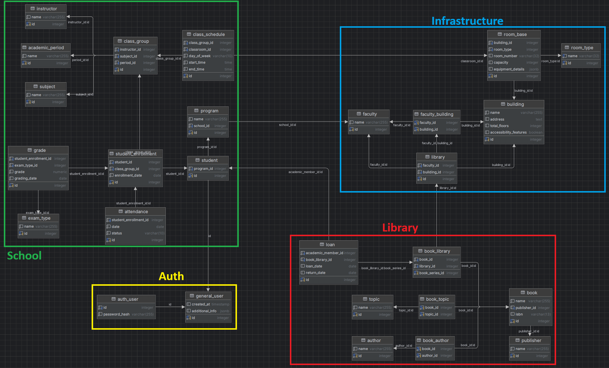

<h1 align="center">
    
    <div align="center">Academic Hub</div>
</h1>

[](https://github.com/Yrrrrrf/academic_hub)

[//]: # ([]&#40;#documentation-section&#41;)

Academic Hub is a comprehensive platform designed to manage academic resources and data, including library inventory, academic user information (students, teachers, etc.), grade history, and more. The system is built on a relational database, supporting various academic operations and providing detailed reports for educational institutions.

## Setup

### Prerequisites

- Install the [PostgreSQL](https://www.postgresql.org/download/) database server and used files inside the [sql](./sql) folder to create the database schema and populate it with sample data.


- Use the latest version of [Python](https://www.python.org/downloads/).
- Install the required packages using the following command:
```bash
# using pip
pip install -r requirements.txt  # using pip
# using conda or mamba
conda install --file requirements.txt  # using conda
mamba install --file requirements.txt  # using mamba
```
- Configure the database connection creating the [.env](./.env) file with the following content:

```bash
DB_NAME = "database_name"  # the name of the database to connect to
HOST = "localhost"  # the host of the database

LIBRARY_USER = "library_user"  # the user for the library
LIBRARY_PSWD = "some_password"  # the password for the library user
SCHOOL_USER = "school_user"  # the user for the school
SCHOOL_PSWD = "somw_password"  # the password for the school user

```
## [License](./LICENSE)

This project is licensed under the terms of the MIT license.
